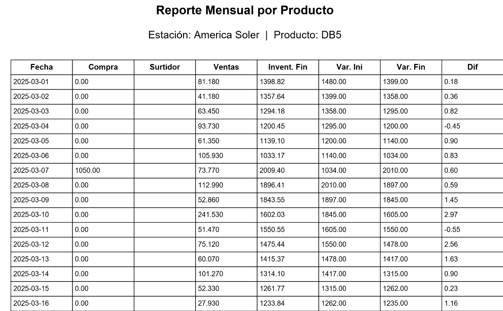
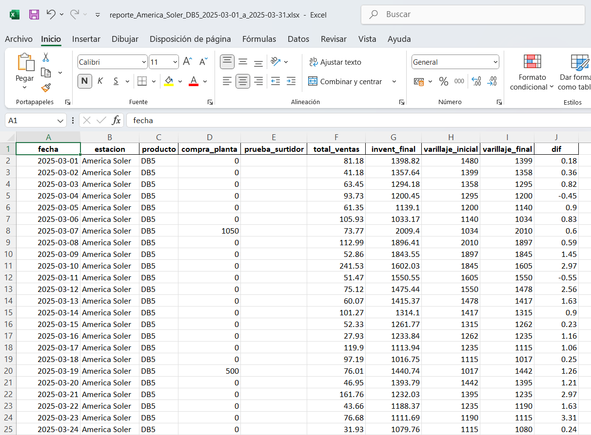
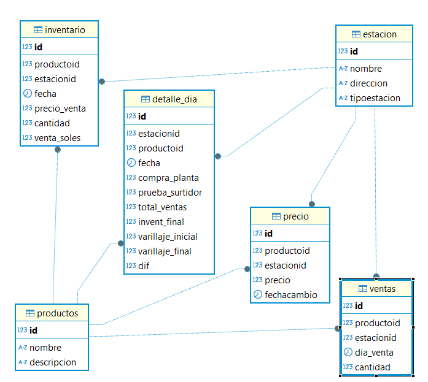

# Proyecto: Automatización de Carga y Reportes para Estaciones de Servicio (Gasolineras)

Este proyecto tiene como objetivo centralizar y automatizar el proceso de carga de archivos Excel provenientes de diferentes estaciones de servicio, almacenarlos en una base de datos MySQL y generar reportes administrativos y regulatorios en PDF y Excel.

---

## Contenido del proyecto
## 🔧 Funcionalidades

- ✅ Carga automatizada de archivos Excel por estación.
- ✅ Registro de productos: GLP, PREMIUM, REGULAR y DB5.
- ✅ Inserción en base de datos MariaDB.
- ✅ Generación de reportes PDF diarios y mensuales por estación.
- ✅ Diagrama de flujo del proceso.
- ✅ Script de respaldo (`backup.sh`) para la base de datos.
- 🖱️ Interfaz gráfica para generación de reportes con Tkinter.

- 📂 Estructura del Proyecto
  
```
gasolinas/
├── estaciones/               # Archivos Excel por estación
├── src/                      # Código fuente
│   ├── cargar_excel.py       # Script para cargar datos desde Excel
│   ├── generar_pdf.py        # Script para generar reporte en PDF
│   ├── backup.sh             # Script para hacer backup de la BD
├── imagenes/
│   ├── diagrama_flujo.png    # Diagrama de flujo del sistema
│   └── imagenes estacion
├── reports/                  # Reportes PDF generados
├── backups/                  # Backups de la base de datos
├── README.md
├── requirements.txt
└── crear_tablas.sql          # Script para crear estructura de la base de datos
```

### 1. Backup de la Base de Datos

- `gasolina1_18-06-2025.sql`: Backup completo de la base de datos `gasolinas1` que contiene las siguientes tablas:
  - `estacion`
  - `productos`
  - `ventas`
  - `detalle_dia`
  - `archivos_procesados`

### 2. Scripts Python

#### a. `cargar_excel_a_mysql.py`
Script que carga un archivo Excel mensual (una hoja por día) a la base de datos. Inserta datos en las tablas `ventas` y `detalle_dia` y evita duplicados mediante `archivos_procesados`.Ingresa en la tabla ventas la cantidad de ventas  en galones vendido de dia de cada producto,carga la tabla delalles_dia con los campos requerida para el reporte de osinergmin, una vez procesado el archivo excel ya no deja ingresar nuevamente el mismo archivo por que ya se encuentra ingresado que se visualisa en la tabla archivos_procesados.

#### b. `procesar_varios_excel.py`
Versión extendida del anterior que procesa automáticamente todos los archivos `.xlsx` del directorio para distintas estaciones muestra el ingreso en la tabla detalles_dia (exporta variaos exceles de varias estaciones).

#### c. `generar_reporte_osinergmi_pdf.py`
Genera un reporte mensual detallado de un producto para una estación específica en formato PDF.

#### d. `generar_reporte_pdf_interactivo.py`
Script de consola que permite al usuario elegir:
- Estación
- Producto
- Mes y Año
Y genera el reporte en PDF.

#### e. `reporte_gui_Tkinter_completo.py`
Interfaz gráfica con Tkinter que permite seleccionar filtros (estación, producto, rango de fechas) y generar:
- Reporte en PDF
- Reporte en Excel

#### f. `reporte_pdf_rango_de_fechas_interactivo.py`
(Script auxiliar usado en pruebas): Versión por consola que permite generar un reporte PDF por rango de fechas ingresado manualmente.

---

## Archivos de Entrada (Ejemplos)

- `AMERICA_MARZO_2025.xlsx`
- `RINCONADA_MARZO_2025.xlsx`
- `PORVENIR_MARZO_2025.xlsx`

Cada archivo representa un mes completo de ventas por estación, con una hoja por día. Las filas 7 a 10 contienen datos para los productos:
- GLP
- PREMIUM
- REGULAR
- DB5

Columnas clave importadas:
- A: `comb` (producto)
- C: `compra_planta`
- D: `prueba_surtidor`
- G: `total_ventas`
- K: `invent_final`
- L: `varillaje_inicial`
- M: `varillaje_final`
- Q: `dif`

---

## Reportes Generados

### Ejemplos:

- `reporte_America_Soler_GLP_2025_03.pdf`
  
  
  
  
  
- `reporte_La_America_DB5_2025-03-01_a_2025-03-31.xlsx`
  
  
 

Todos los reportes incluyen:
- Cabecera con estación, producto y rango de fechas.
- Tabla con los campos cargados desde el Excel.
- Valores numéricos con tres decimales.

---

## Recursos visuales

- `relaciones_bd.png`: Diagrama relacional de la base de datos `gasolinas1`.
  
  
  
- `america_soler.jpg`, `rinconada.jpg`, `porvenir.jpg`: Imagen de cada estación para uso en documentación o interfaz.
  
  
  
  
  
  
  
  
---

## Requisitos del entorno

- Python >= 3.9
- MySQL Server o XAMPP
- Librerías Python:
  - `pandas`
  - `mysql-connector-python`
  - `fpdf`
  - `tkinter` (incluida en instalaciones oficiales de Python)

Instalación de librerías:
```bash
pip install pandas mysql-connector-python fpdf
```

---

## Objetivo del proyecto

Este sistema fue diseñado para ayudar a operadores de estaciones de servicio a:
- Controlar y almacenar mensualmente los datos de ventas.
- Detectar diferencias de inventario.
- Presentar reportes confiables a entes reguladores como OSINERGMIN.
- Optimizar el proceso de consolidación de datos multiestación.
---
## Créditos y contacto
- Desarrollado por: ing. FREDY APOLINARIO ALCOCER  
- Fecha: Junio 2025  
- Contacto:fredyapolinario78@hotmail.com
- GitHub - falcocer01: https://github.com/falcocer01/gasolinas.git
